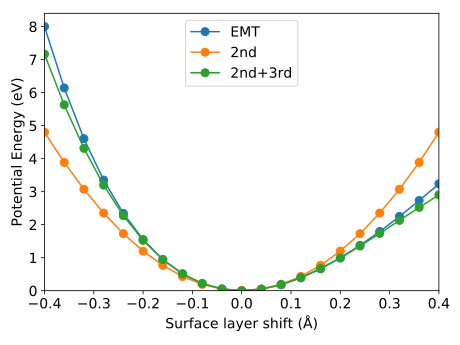
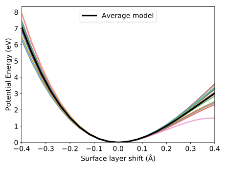

.. _advanced_topics_anharmonic_pes:
.. highlight:: python
.. index::
   single: Anharmonic potential energy surfaces

Anharmonic energy surfaces
==========================

In this tutorial we study the potential energy surface (PES) for a (110) Cu
slab. The atoms at the surface experience a strong anharmonic PES due to the
asymmetry in bonds normal to the surface. We test how well 2nd and 3rd order
models can describe this PES by examining their capacity to predict the energy
landscape when shifting the entire top surface layer up and down.

    Energy surface obtained from the full model (EMT) as well as a 2nd and
    2nd+3rd order force constant potential.

By carrying out ensemble fitting (`bagging <http://scikit-learn.org/stable/modules/ensemble.html>`_)
we obtain a distribution of force constant models. Using these models we can
estimate how sensitive our model is with respect to a complex property such as
the PES.

    Several 2nd+3rd models compared with the ensemble average (bold black
    line).

This also illustrates the advantage of ensemble fitting and using averaged
parameters. The average model is much more stable and less prone to
`overfitting <(https://en.wikipedia.org/wiki/Bootstrap_aggregating)>`_.

It is important to remember though to feed the model with good data, i.e. if
we want to sample the PES with displacements up to 0.5 A we should not train
the model with configurations rattled with 0.01 A.

Source code
-----------

.. |br| raw:: html

    

.. container:: toggle

    .. container:: header

       Prepare data |br|
       ``examples/advanced_topics/anharmonic_energy_surface/1_prepare_data.py``

    .. literalinclude:: ../../../examples/advanced_topics/anharmonic_energy_surface/1_prepare_data.py

.. container:: toggle

    .. container:: header

       Setup structure continaer |br|
       ``examples/advanced_topics/anharmonic_energy_surface/2_setup_containers.py``

    .. literalinclude:: ../../../examples/advanced_topics/anharmonic_energy_surface/2_setup_containers.py

.. container:: toggle

    .. container:: header

       Energy surface |br|
       ``examples/advanced_topics/anharmonic_energy_surface/3_energy_surface.py``

    .. literalinclude:: ../../../examples/advanced_topics/anharmonic_energy_surface/3_energy_surface.py

.. container:: toggle

    .. container:: header

       Ensemble energy surface |br|
       ``examples/advanced_topics/anharmonic_energy_surface/4_ensemble_energy_surface.py``

    .. literalinclude:: ../../../examples/advanced_topics/anharmonic_energy_surface/4_ensemble_energy_surface.py

.. container:: toggle

    .. container:: header

       Utility functions |br|
       ``examples/advanced_topics/anharmonic_energy_surface/tools.py``

    .. literalinclude:: ../../../examples/advanced_topics/anharmonic_energy_surface/tools.py
