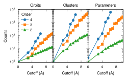

.. _advanced_topics_cluster_analysis:
.. highlight:: python
.. index::
   single: Cluster analysis

Cluster analysis
================

This example demonstrates how to analyze a cluster space and to extract the
number of orbits, clusters, and parameters as a function of the cutoff radii
for each order. Such an analysis is particularly useful in preparation of a
compressive sensing optimization run.

  Number of orbits, clusters, and parameters as a function of cutoff radius
  for FCC Al.

Source code
-----------

.. |br| raw:: html

    

.. container:: toggle

    .. container:: header

        The complete source code is available in |br|
        ``examples/advanced_topics/cluster_analysis/cluster_analysis.py``

    .. literalinclude:: ../../../examples/advanced_topics/cluster_analysis/cluster_analysis.py
