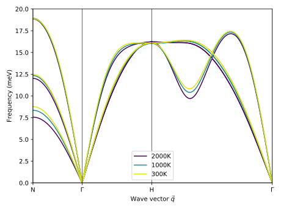

.. _advanced_topics_effective_harmonic_models:
.. highlight:: python
.. index::
   single: Effective harmonic models

Effective harmonic models
=========================

Using :program:`hiPhive` it is straightforward to generate effective harmonic
models (EHMs) from molecular dynamics (MD) trajectories. These models enable
one to describe one for example the temperature dependence of the phonon
dispersion as well as derived quantities such as the harmonic free energy.

In this example we look construct EHMs from MD simulations for BCC tantalum. 
We use cutoffs of 6.0

With increasing temperature the ability of an EHM to map the forces present in
the structure decreases as evident from the root-mean-square errors over the
training set:

    =============== ==================
    Temperature (K) Train RMSE (meV/A)
    =============== ==================
    300              41.3
    1000             148.7
    2000             315.2
    =============== ==================

The phonon dispersions obtained in this fashion are shown in the following
figure.

  Phonon dispersions for BCC Ta from a series of effective harmonic models
  generated from MD trajectories recorded at different temperatures.

Source code
-----------

.. |br| raw:: html

    

.. container:: toggle

    .. container:: header

       MD structures are generated in |br|
       ``examples/advanced_topics/temperature_dependent_phonons/3a_run_fcp_md.py``

    .. literalinclude:: ../../../examples/advanced_topics/temperature_dependent_phonons/3a_run_fcp_md.py

.. container:: toggle

    .. container:: header

       Effective harmonic models are constructed in |br|
       ``examples/advanced_topics/temperature_dependent_phonons/3b_train_ehms.py``

    .. literalinclude:: ../../../examples/advanced_topics/temperature_dependent_phonons/3b_train_ehms.py

.. container:: toggle

    .. container:: header

       Phonon dispersion are plotted using |br|
       ``examples/advanced_topics/temperature_dependent_phonons/4b_plot_ehm_phonons.py``

    .. literalinclude:: ../../../examples/advanced_topics/temperature_dependent_phonons/4b_plot_ehm_phonons.py
