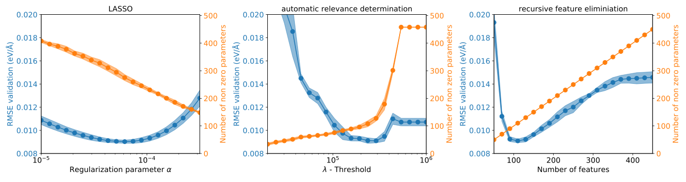
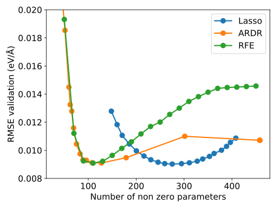
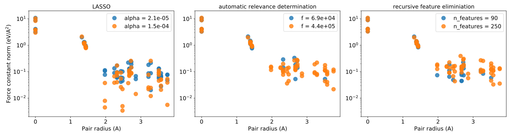

.. _feature_selection:
.. highlight:: python
.. index::
   single: Feature selection

Feature selection
=================

In this example we explore the concept of feature selection while considering
three different methods

* `Least absolute shrinkage and selection operator (LASSO) <http://scikit-learn.org/stable/modules/generated/sklearn.linear_model.Lasso.html>`_
* `Automatic relevance determination regression (ARDR) <http://scikit-learn.org/stable/modules/generated/sklearn.linear_model.ARDRegression.html>`_
* `Recursive feature elimination (RFE) <http://scikit-learn.org/stable/modules/generated/sklearn.feature_selection.RFE.html>`_

These methods solve the linear problem

.. math::
    \boldsymbol{A}\boldsymbol{x} = \boldsymbol{b},

where :math:`\boldsymbol{A}` is the fit matrix, :math:`\boldsymbol{x}`
represents the parameters to be determined, and :math:`\boldsymbol{b}`
are the target values.

The present tutorial has the objective to showcase the different
algorithms and is not indented as a comprehensive introduction. The
reader is rather strongly encouraged to turn to the existing
literature on feature selection in machine learning. Here, the links
include in the list above provide useful starting points. It should
also be noted that for instance `scikit-learn
<http://scikit-learn.org/>`_, which implements the algorithms employed
here, provides further interesting feature selection techniques, such
as orthogonal matching pursuit, which can be used with
:program:`hiPhive` with little additional effort as demonstrated in
:ref:`another tutorial <advanced_topics_interface_sklearn>`.

LASSO
-----

The `least absolute shrinkage and selection operator (LASSO)
<http://scikit-learn.org/stable/modules/generated/sklearn.linear_model.Lasso.html>`_
minimizes the objective function

.. math::

    \frac{1}{2 N} || \boldsymbol{A}\boldsymbol{x} - \boldsymbol{b} ||^2_2
    + \alpha ||\boldsymbol{x}||_1,

where :math:`\alpha` is the regularization parameter that determines the
sparsity of the solution and :math:`N` is the number of rows in
:math:`\boldsymbol{A}`.

LASSO thus aims at obtaining sparse solutions by directly minimizing
the :math:`\ell_1`-norm of the model parameter vector

.. math::
    ||\boldsymbol{x}||_1 = n^{-1} \sum_i |x_i|,

where :math:`n` is the number of parameters (or elements of
:math:`\boldsymbol{x}`).

When fitting with LASSO one sometimes obtains the following warning
from scikit-learn:

    *ConvergenceWarning: Objective did not converge. You might want to
    increase the number of iterations. Fitting data with very small
    alpha may cause precision problems.*

This can be solved, as suggested by the warning, by increasing
``max_iter``. Hence in this tutorial ``max_iter=100000`` is used,
which makes this tutorial and specifially the LASSO part
computationally more demanding. It should be noted that the result
will not differ too much when reducing ``max_iter``. Tthe convergence
warnings from scikit-learn should, however, be taken seriously.

ARDR
----

`Automatic relevance determination regression (ARDR)
<http://scikit-learn.org/stable/modules/generated/sklearn.linear_model.ARDRegression.html>`_
is a Bayesian regression techniques that assigns priors to both the
model parameters and the hyperparameters. It is also known as sparse
Bayesian learning (SBL) or relevance vector machine (RVM). In ARDR the
:math:`\lambda`-threshold parameter can be used for removing (pruning)
weights with high precision from the computation.

RFE
---

`Recursive feature elimination (RFE)
<http://scikit-learn.org/stable/modules/generated/sklearn.feature_selection.RFE.html>`_
is, as the name suggests, a feature selection algorithm. While RFE can
be used in combination with any linear regression solver, here we use
ordinary least squares. RFE has a hyper parameter ``n_features``,
which is the number of features to be selected. First, a fit is
constructed with all features. Then the least important (or weakest)
features are removed and a new fit is constructed. This is repeated
until ``n_features`` are left. In our optimizer, if ``n_features`` is
not specified the optimal value of this hyper-parameter will be found
by cross-validation analysis.

Figures
-------

Plotting the validation root mean squared error against the number of
features reveals that LASSO has its minimum at roughly twice as many
parameters compared to the other two algorithms. This may lead to a
less transferable model.

It is also noteworthy that for fully dense solutions, ARDR performs
better than the other two algorithms.

The obtained force constant models for a few selection parameters are
shown below.

Source code
-----------

.. |br| raw:: html

    

.. container:: toggle

    .. container:: header

        Structure preparation |br|
        ``examples/advanced_topics/feature_selection/1_prepare_structures.py``

    .. literalinclude:: ../../../examples/advanced_topics/feature_selection/1_prepare_structures.py

.. container:: toggle

    .. container:: header

        Setup of structure container |br|
        ``examples/advanced_topics/feature_selection/2_setup_structure_container.py``

    .. literalinclude:: ../../../examples/advanced_topics/feature_selection/2_setup_structure_container.py

.. container:: toggle

    .. container:: header

        Feature selection |br|
        ``examples/advanced_topics/feature_selection/3_feature_selection.py``

    .. literalinclude:: ../../../examples/advanced_topics/feature_selection/3_feature_selection.py
