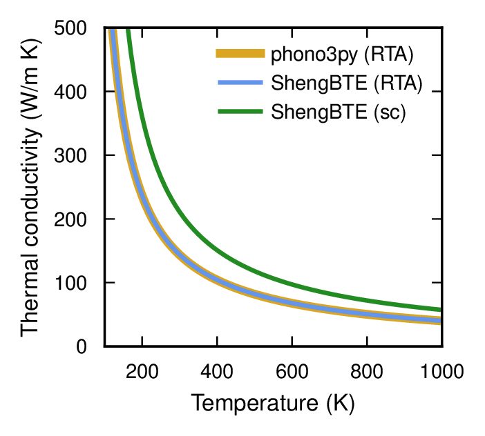

.. _force_constants_io:
.. highlight:: python
.. index::
   single: Force constants IO

Force constants IO
==================
Hiphive provides read and write functionality for force constants in a few different
formats. Currently the following formats are supported.

* `phonopy <https://atztogo.github.io/phonopy/>`_
* `phono3py <https://atztogo.github.io/phono3py/>`_
* `ShengBTE <http://www.shengbte.org/>`_

GPUMD
-----

We also support functionality for writing force constants and other
relevant files to `GPUMD <https://gpumd.zheyongfan.org/>`_
format. GPUMD is a packages that allows one to calculate for example
thermal conductivities using molecular dynamics (MD) simulations both
via the Green-Kubo and the homogenenous non-equilibrium MD approach.

Conversion betweeen ShengBTE and phono3py
-----------------------------------------

The following snippet demonstrates the conversion from phono3py to ShengBTE::

    from hiphive import ForceConstants
    from ase.io import read

    prim = read('POSCAR')
    supercell = read('SPOSCAR')
    fcs = ForceConstants.read_phono3py(supercell, 'fc3.hdf5')
    fcs.write_to_shengBTE('FORCECONSTANTS_3rd', prim)

Conversion in the opposite direction is achieved as follows::

    from hiphive import ForceConstants
    from ase.io import read

    prim = read('POSCAR')
    supercell = read('SPOSCAR')
    fcs = ForceConstants.read_shengBTE(supercell, 'FORCECONSTANTS_3rd', prim)
    fcs.write_to_phono3py('fc3.hdf5')

This allows one for example to check the equivalence of the thermal
conductivity calculated using either one of the two codes. This is demonstrated
for the case of a monolayer of MoS2 in the following example. The
original force constants were generated using the `thirdorder.py` code
associated with ShengBTE. Only phonon-phonon scattering was considered as a
lifetime limiting process (i.e. neither isotope nor boundary scattering were
included). Calculations were carried out within the relaxation time
approximation (RTA) for both codes. In the case of ShengBTE we also solved the
Boltzmann transport equation self-consistently (sc).

    Thermal conductivity of a monolayer of MoS2 using both phono3py and ShengBTE.
