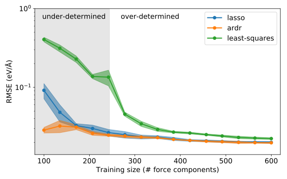

.. _advanced_topics_learning_curve:
.. highlight:: python
.. index::
   single: Learning curve

Learning curve
==============

This tutorial demonstrates the convergence behavior of three common
optimization algorithms with respect to training set size. Specifically, it
considers
standard `least-squares regression <https://en.wikipedia.org/wiki/Least_squares>`_,
`LASSO <http://scikit-learn.org/stable/modules/generated/sklearn.linear_model.Lasso.html>`_
and
`automated relevance detection regression (ARDR) <http://scikit-learn.org/stable/modules/generated/sklearn.linear_model.ARDRegression.html>`_.

After  the generation of several reference structures, a fourth-order model for
EMT Ni is constructed. Subsequently, the :class:`CrossValidationEstimator <trainstation.CrossValidationEstimator>` is used to obtain the variation of the
cross validation (CV) score with training set size and the results are plotted.

Notes
-----

* The performance of the Lasso and ARDR can vary depending on the
  hyperparameters, especially in the underdetermined regime.

* The CV score is an *estimate* of the predictive power of a model. Different
  training set choices will lead to slightly different results.

.. warning::

  Please note that calling functions that rely on the generation of pseudo-
  random numbers *repeatedly with the same seed* (i.e., repeatedly falling back
  to the default value) is **strongly** discouraged as it will lead to
  correlation. To circumvent this problem one can for example seed a sequence
  of random numbers and then use these numbers in turn as seeds.

Source code
-----------

.. |br| raw:: html

    

.. container:: toggle

    .. container:: header

       The structure container is built in |br|
       ``examples/advanced_topics/learning_curve/1_setup_structure_container.py``

    .. literalinclude:: ../../../examples/advanced_topics/learning_curve/1_setup_structure_container.py

.. container:: toggle

    .. container:: header

       The learning curves are constructed and plotted in |br|
       ``examples/advanced_topics/learning_curve/2_construct_learning_curves.py``

    .. literalinclude:: ../../../examples/advanced_topics/learning_curve/2_construct_learning_curves.py
