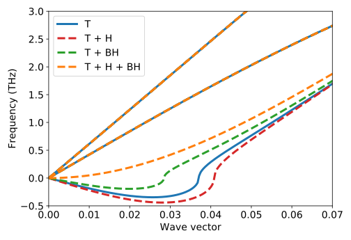
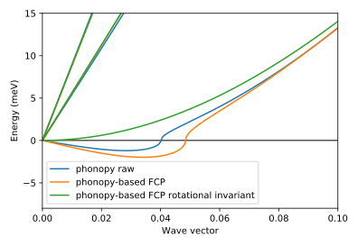

.. _rotational_sum_rules:
.. highlight:: python
.. index::
   single: Rotational sum rules

Rotational sum rules
====================

In this tutorial we will study the importance of rotational sum rules and how
they can be enforced in :program:`hiphive`. These sum rules can currently only be
applied to the second order force constants.

The rotational sum rules are dependent on the translational sum rule being
fulfilled, i.e.

.. math::
    \sum_i\Phi_{ij}^{\alpha\beta} = 0.

The first rotational sum rule we consider is the Born-Huang condition

.. math::
    \sum_j\Phi_{ij}^{\alpha\beta}r_j^\gamma = \sum_j\Phi_{ij}^{\alpha\gamma}r_j^\beta,

where :math:`r_j^\beta` is the position vector of atom
:math:`j`. Furthermore we consider the Huang invariances

.. math::
    \sum_{ij}\Phi_{ij}^{\alpha\beta}r_{ij}^\gamma r_{ij}^\delta
    = \sum_{ij}\Phi_{ij}^{\gamma\delta}r_{ij}^\alpha r_{ij}^\beta.

MoS2 monolayer
--------------

We will use a MoS2 monolayer to showcase the importance of
correctly imposing rotational sum rules, which are necessary in order
to correctly obtain a quadratic dispersion for the lowermost
transverse acoustic mode in the vicinity of the :math:`\Gamma`-point.

Forces from density functional theory (DFT) calculations are supplied
in the ``MoS2_rattled_structures.extxyz`` file.

    Phonon dispersion for MoS2 close to the gamma point with translational (T)
    sum rules as well as Born-Huang (BH) and Huang (H) invariances enforced.

It is evident from the figure that it is important to enforce both of
the aforementioned rotational sum rules in order to obtain a correct
dispersion.

Source code
~~~~~~~~~~~

.. |br| raw:: html

    

.. container:: toggle

    .. container:: header

       Set up structure container |br|
       ``examples/advanced_topics/rotational_sum_rules/MoS2_monolayer/1_setup_structure_container.py``

    .. literalinclude:: ../../../examples/advanced_topics/rotational_sum_rules/MoS2_monolayer/1_setup_structure_container.py

.. container:: toggle

    .. container:: header

       Construct force constant potentials while imposing different sum rules |br|
       ``examples/advanced_topics/rotational_sum_rules/MoS2_monolayer/2_construct_fcps.py``

    .. literalinclude:: ../../../examples/advanced_topics/rotational_sum_rules/MoS2_monolayer/2_construct_fcps.py

.. container:: toggle

    .. container:: header

       Plot the phonon dispersion for each force constant potential |br|
       ``examples/advanced_topics/rotational_sum_rules/MoS2_monolayer/3_plot_dispersions.py``

    .. literalinclude:: ../../../examples/advanced_topics/rotational_sum_rules/MoS2_monolayer/3_plot_dispersions.py

The alpha parameter
-------------------
This post processing method has a parameter :math:`\alpha` which determines how much the parameters can change in order to enforce the sum rules.
Below the phonon dispersion for various values of :math:`\alpha` is shown.

.. figure:: _static/rotational_sum_rules.svg

The analysis shows that for small values of :math:`\alpha` the rotational sum rules are correctly enforced as the parameters are allowed to change a lot.
It is also apparent that the lowest optical branch is affected by the post-processing of the force constants.
When :math:`\alpha` increases the dispersion moves towards the dispersions without rotational sum rules.

Fitting with constraints
------------------------
In the examples above the rotational constraints are imposed after the fitting/extraction of
the parameters (force-constants) is completed.
Another approach to enforcing rotational constraints is to include them during fitting.
This task can be cast in an extended linear form

.. math::
  \left\Vert\boldsymbol{A}\boldsymbol{x} - \boldsymbol{f}\right\Vert^2_2 + \lambda \left\Vert\ \boldsymbol{A}_\text{rotational} \boldsymbol{x}\right\Vert^2_2

where the first term is the normal equation for minizing the error of the forces, :math:`\boldsymbol{A}_\text{rotational}` is the rotational constraint matrix, and :math:`\lambda` is the parameter that adjusts how strongly to enforce the rotational constraints.
This integrated approach is advantageous to the post-processing approach as the enforcement of the rotational sum rules has a smaller effect on the overall dispersion as shown in the figure below.
The quadratic dispersion is recovered and the lowest optical mode is not affected by this approach.

.. figure:: _static/rotational_sum_rules_when_fitting.svg

The `source code for this analysis <https://gitlab.com/materials-modeling/hiphive-examples/-/tree/master/advanced/rotational_sum_rules>`_ can be found in the `hiphive-examples repository <https://gitlab.com/materials-modeling/hiphive-examples>`_.
The same scheme also allow one to enforce the translational sum rules as demonstrated by `this example <https://gitlab.com/materials-modeling/hiphive-examples/-/tree/master/advanced/translational_sum_rules>`_.

Graphene
--------

Graphene is another 2D-material where the rotational sum rules can
make a huge difference in the dispersion near the gamma point.

Functionality exists in hiphive to project existing force constants
onto a :class:`ClusterSpace <hiphive.ClusterSpace>`, as described
:ref:`here <fcs_sensing>`. Together with the functionality to enforce
the rotational sum rules this opens up for the possibility to correct
force constants calculated with external tools such as e.g., phonopoy.

Extracting the harmonic force constants with phonopy for graphene only
requires one supercell calculation. This structure together with
forces from density functional theory (DFT) calculations are supplied
here in the ``graphene_phonopy_supercell.extxyz`` file.

    Phonon dispersion for graphene close to the gamma point.

The dispersions from phonopy and the one parametrized using the
extracted parameters closely match either other. Both dispersions
exhibit, however, a non-quadratic imaginary pocket in the vicinity of
the Gamma point. This pocket vanishes and the correct quadratic
dispersion is obtained by enforcing the rotational sum rules.

Source code
~~~~~~~~~~~
.. container:: toggle

    .. container:: header

       graphene example
       ``examples/advanced_topics/rotational_sum_rules/graphene/graphene.py``

    .. literalinclude:: ../../../examples/advanced_topics/rotational_sum_rules/graphene/1_graphene.py

