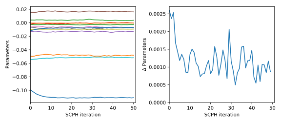
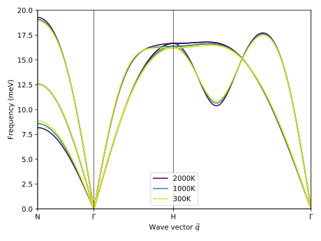

.. _self_consistent_phonons_tutorial:
.. highlight:: python
.. index::
   single: Self-consistent phonons

Self-consistent phonons
=======================

In this section the usage of the basic self-consistent phonons module in
:program:`hiphive` is demonstrated. We use the same example as in the
:ref:`effective harmonic models tutorial <advanced_topics_effective_harmonic_models>`
i.e. BCC tantalum.

The :ref:`basic algorithm for self-consistent phonons
<self_consistent_phonons>` in :program:`hiphive` resembles the
algorithm in [ErrCalMau14]_.

First an harmonic model :math:`\Phi(\mathbf{x}_0)` is generated from the
initial parameter vector :math:`\mathbf{x}_0` obtained from fitting with
structures with small random displacements.

This initial harmonic model, :math:`\Phi(\mathbf{x}_0)`, can be used to
generate phonon rattled structures at the desired temperature. These structures
are used to fit new parameters :math:`\mathbf{x}_\text{new}`. In order for the
algorithm to converge smoothly we compute :math:`\mathbf{x}_1` as

.. math::
    \mathbf{x}_1 = \alpha\mathbf{x}_\text{new} + (1-\alpha)\mathbf{x}_0

Next, structures are generated using :math:`\Phi(\mathbf{x}_1)` and the
procedure is repeated. The :math:`n`-th step in the algorithm would formally be

.. math::
    \mathbf{x}_{n+1} = \alpha \, \underset{\mathbf{x}}{\text{argmin}} (\left < (H - \Phi(\mathbf{x}))^2 \right >_{\Phi(\mathbf{x}_{n})}) + (1-\alpha)\mathbf{x}_{n},

where :math:`H` denotes the reference potential.

In this example, self-consistent phonons are obtained for 500, 1500 and 2500 K.
The phonon dispersion is constructed for each temperature and a clear
temperature dependency can be observed. This can be compared to
the :ref:`effective harmonic models <advanced_topics_effective_harmonic_models>`.

    Convergence of self-consistent phonon (SCPH) algorithm for 2500 K. The individual harmonic parameters
    shown on the left and the norm of the change in parameters on the right.

    Phonon dispersions for BCC Ta from a series of SCPH models.

Please note that in practice you usually would use a larger number of
structures leading to smoother convergence.

Source code
-----------

.. |br| raw:: html

    

.. container:: toggle

    .. container:: header

       Run self-consistent phonons |br|
       ``examples/advanced_topics/temperature_dependent_phonons/2_run_scph.py``

    .. literalinclude:: ../../../examples/advanced_topics/temperature_dependent_phonons/2_run_scph.py

.. container:: toggle

    .. container:: header

       Plot SCPH phonon dispersions |br|
       ``examples/advanced_topics/temperature_dependent_phonons/4a_plot_scph_phonons.py``

    .. literalinclude:: ../../../examples/advanced_topics/temperature_dependent_phonons/4a_plot_scph_phonons.py
