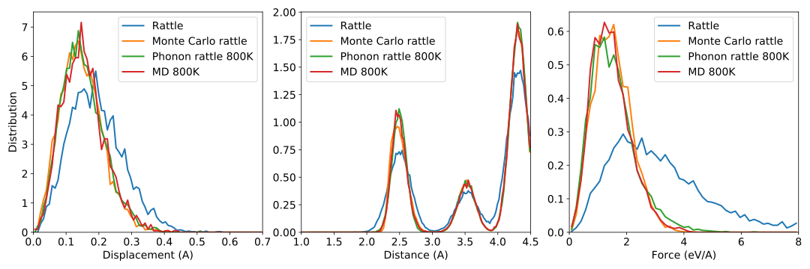

.. _advanced_topics_structure_generation:
.. highlight:: python
.. index::
   single: Structure generation

Structure generation
====================

The construction of force constant potentials (FCPs) crucially depends
on the availability of suitable training and validation data. Once
configurations are available the atomic forces can be readily
computed, typically using methods such as density functional theory
(DFT). The latter is demonstrated in the :ref:`tutorial on reference
calculations <advanced_topics_reference_calculations>`.

It is, however, essential that the configurations in the training and
validation sets represent a distribution of displacements (and ultimately
forces) that resemble configurations that are observed under dynamic conditions.
While it is of course possible to run (*ab-initio*) molecular dynamics (MD)
simulations to generate such configurations, it is computationally desirable to
limit the number of such calculations.

Standard rattle (rattle)
------------------------

It is straightforward to generate "rattled" configurations by randomly drawing
displacements from a normal distribution. This is achieved e.g., by the
:func:`rattle` function of the ASE :class:`Atoms` class. In the present example
it is shown that while this approach yields displacement distributions that
resemble MD simulations the distribution of forces, however, exhibits a long
tail with some atoms experiencing extremely large forces. This behavior can be
traced to some interatomic distances becoming very small whence the atoms
sample the very steep repulsive branch of the interaction potential. This is
for example apparent from the pair distribution function, which is shown in the
middle panel of the figure below.

Monte Carlo modified rattle procedure (MC-rattle)
-------------------------------------------------

To circumvent this problem :program:`hiphive` provides a modified rattle
procedure, which combines randomly drawing displacements with a Monte Carlo
(MC) trial step that penalizes displacements that lead to very small
interatomic distances. The resulting displacement and force distributions mimic
the results from MD simulations and thus provide sensible input configurations
for reference calculations without the need to carry out MD simulations using
the reference method. This method does, however, require some material
dependent fine tuning.

Superposition of normal modes (phonon-rattle)
---------------------------------------------

Physically sound displacement patterns can in principle be constructed from a
knowledge of the harmonic force constants. Superposing the respective normal
modes with randomized phase factors allows one to readily generate structures
representative of different temperatures without introducing additional
parameters. This approach, referred to here as phonon-rattle, will also
automatically account for differences in the thermal displacements between
different species and crystallographic sites.

While this approach requires a set of harmonic force constants, a rough
approximation is usually sufficient as a starting point as it can be
iteratively improved as needed. One would thus start with a small number of
rattled structures to construct a first approximation of the harmonic force
constants. Using the latter one can then generate new structures by
superposition of normal modes and then use these structures to construct a new
model. This process can be continued in iterative fashion as needed.

The phonon-rattle approach yields distributions in rather close agreement with
MD simulations and does not require tuning of hyperparameters (as in the case
of MC-rattle).

  Distribution of displacements, distances, and forces for structures
  obtained by the standard rattle and Monte Carlo rattle and phonon-rattle
  procedures as well as MD simulations using the reference potential.

Source code
-----------

.. |br| raw:: html

    

.. container:: toggle

    .. container:: header

       Rattled structures are generated in |br|
       ``examples/advanced_topics/structure_generation/1_generate_rattle_structures.py``

    .. literalinclude:: ../../../examples/advanced_topics/structure_generation/1_generate_rattle_structures.py

.. container:: toggle

    .. container:: header

       Structures from molecular dynamics (MD) simulations are generated in |br|
       ``examples/advanced_topics/structure_generation/2_generate_md_structures.py``

    .. literalinclude:: ../../../examples/advanced_topics/structure_generation/2_generate_md_structures.py

.. container:: toggle

    .. container:: header

       The force distributions are analyzed in |br|
       ``examples/advanced_topics/structure_generation/3_analyze_force_distribution.py``

    .. literalinclude:: ../../../examples/advanced_topics/structure_generation/3_analyze_force_distribution.py
