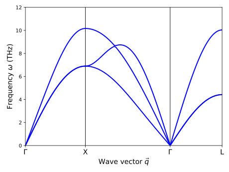

.. _tutorial_harmonic_thermal_properties:
.. highlight:: python
.. index::
   single: Thermal properties in the harmonic approximation

Thermal properties in the harmonic approximation
================================================

This section of the tutorial demonstrates how an existing FCP can be employed
in conjunction with `phonopy <https://atztogo.github.io/phonopy/>`_ to analyze
the thermal properties of a material in the harmonic approximation.

Note that this analysis by definition invokes only the second-order force
constants and primarily relies on `phonopy
<https://atztogo.github.io/phonopy/>`_.

Preparations
------------

First a number of parameters are defined that influence the subsequent
analysis. They have been moved to the top for clarity and convenience.

.. literalinclude:: ../../../examples/tutorial/3_compute_harmonic_thermal_properties.py
   :end-before: # set up phonopy

Next we define the primitive structure (``prim``) along with a
corresponding :class:`PhonopyAtoms` object (``atoms_phonopy``), and
initialize a :class:`Phonopy` object (``phonopy``) that represents the
chosen supercell size.

.. literalinclude:: ../../../examples/tutorial/3_compute_harmonic_thermal_properties.py
   :start-after: # set up phonopy
   :end-before: # get force constants
		
Now we can load the FCP generated :ref:`previously
<tutorial_construct_fcp>` from a file using the
:func:`ForceConstantPotential.read
<hiphive.ForceConstantPotential.read>` function and retrieve
the supercell (``supercell``) from the `phonopy` object, for which we
want to set up the second-order force constant matrix. The latter is
then generated using the
:func:`ForceConstantPotential.get_force_constants
<hiphive.ForceConstantPotential.get_force_constants>` method.

.. literalinclude:: ../../../examples/tutorial/3_compute_harmonic_thermal_properties.py
   :start-after: # get force constants
   :end-before: # get mean square displacements

At the end of the block, we use the :func:`print` function to get a compact view of
the force constant matrix, which yields an output akin to the following block::

  =================== ForceConstants ===================
  Orders: [2, 3, 4]
  Atoms: Atoms(symbols='Ni125', pbc=True, cell=[[0.0, 8.8, 8.8], [8.8, 0.0, 8.8], [8.8, 8.8, 0.0]])
  
  Cluster: (0, 0)
  Atom('Ni', [0.0, 0.0, 0.0], index=0)
  Atom('Ni', [0.0, 0.0, 0.0], index=0)
  force constant:
  [[11.55459  0.      -0.     ]
   [ 0.      11.55459 -0.     ]
   [-0.      -0.      11.55459]]
  
  Cluster: (0, 1)
  Atom('Ni', [0.0, 0.0, 0.0], index=0)
  Atom('Ni', [0.0, 1.7600000000000002, 1.7600000000000002], index=1)
  force constant:
  [[ 0.04545  0.      -0.     ]
   [ 0.      -1.55551 -1.6022 ]
   [-0.      -1.6022  -1.55551]]

   ...

Using the :func:`ForceConstants.print_cluster
<hiphive().ForceConstants.print_cluster>` function it is furthermore
possible to access the force constants for specific cluster. Here, a
cluster is referred to by the indices of its sites::

  Cluster: (10, 12)
  Atom('Ni', [3.5200000000000005, 0.0, 3.5200000000000005], index=10)
  Atom('Ni', [3.5200000000000005, 3.5200000000000005, 7.040000000000001], index=12)
  force constant:
  [[ 0.00008 -0.       0.     ]
   [-0.       0.002    0.00463]
   [ 0.       0.00463  0.002  ]]

This concludes the part that involves :program:`hiPhive`.

Harmonic analysis
-----------------

.. _tutorial_harmonic_msds:

Mean-square displacements
^^^^^^^^^^^^^^^^^^^^^^^^^

Now we can conduct an analysis of the mean-square displacement (and
potentially other thermal properties) at several temperatures.

.. literalinclude:: ../../../examples/tutorial/3_compute_harmonic_thermal_properties.py
   :start-after: # get mean square displacements
   :end-before: # FCC q-point paths

This yields::

    T =  300 K    MSD = 0.01326 A**2
    T =  600 K    MSD = 0.02550 A**2
    T =  900 K    MSD = 0.03797 A**2
    T = 1200 K    MSD = 0.05049 A**2

In the :ref:`molecular dynamics (MD) tutorial section
<tutorial_molecular_dynamics_simulations>` these data are compared
with MD results.

.. _tutorial_phonon_dispersion:

Phonon dispersion
^^^^^^^^^^^^^^^^^

It is equally straightforward to extract the phonon dispersion. After one has
defined a path through the Brillouin zone (BZ) this only requires two lines of
code thanks to `phonopy <https://atztogo.github.io/phonopy/>`_.

.. literalinclude:: ../../../examples/tutorial/3_compute_harmonic_thermal_properties.py
   :start-after: # FCC q-point paths
   :end-before: # plot dispersion

Finally, we can plot the phonon dispersion using `matplotlib
<https://matplotlib.org/>`_.

.. literalinclude:: ../../../examples/tutorial/3_compute_harmonic_thermal_properties.py
   :start-after: # plot dispersion

This yields the following dispersion, which is virtually indistinguishable from
the dispersion one obtains when using the EMT calculator directly.

  Phonon dispersion of FCC nickel according to a force constant potential
  constructed using input data generated using an EMT potential.

Source code
-----------

.. container:: toggle

    .. container:: header

       The complete source code is available in
       ``examples/tutorial/3_compute_harmonic_thermal_properties.py``

    .. literalinclude:: ../../../examples/tutorial/3_compute_harmonic_thermal_properties.py
