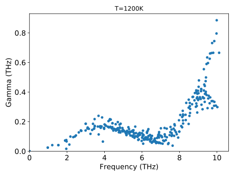

.. _tutorial_phonon_lifetimes:
.. highlight:: python
.. index::
   single: Phonon lifetimes

Phonon lifetimes
================

This section of the tutorial demonstrates how an existing FCP can be
employed in conjunction with `phono3py
<https://atztogo.github.io/phono3py/>`_ to analyze properties that are
related to the third-order force constants such as phonon lifetimes
(considering only phonon-phonon scattering).  Note that this analysis
invokes also the second-order force constants and requires a working
installation of `phono3py <https://atztogo.github.io/phono3py/>`_.

Preparations
------------

First a number of parameters are defined that influence the subsequent
analysis. They have been moved to the top for clarity and convenience.

.. literalinclude:: ../../../examples/tutorial/4_compute_third_order_properties.py
   :end-before: # get phono3py supercell

Next we define the primitive structure (``prim``) along with a
corresponding :class:`PhonopyAtoms` object (``atoms_phonopy``), and
initialize a :class:`Phonopy` object (``phonopy``) that represents the
chosen supercell size.

.. literalinclude:: ../../../examples/tutorial/4_compute_third_order_properties.py
   :start-after: # get phono3py supercell
   :end-before: # get force constants

Now we can load the FCP generated :ref:`previously
<tutorial_construct_fcp>` from a file using the
:func:`ForceConstantPotential.read
<hiphive.ForceConstantPotential.read>` function and retrieve
the supercell (``supercell``) from the `phonopy` object, for which we
want to set up the second and third-order force constant matrices. The latter
are then generated using the
:func:`ForceConstantPotential.get_force_constants
<hiphive.ForceConstantPotential.get_force_constants>` method.

.. literalinclude:: ../../../examples/tutorial/4_compute_third_order_properties.py
   :start-after: # get force constants
   :end-before: # write force constants and POSCAR

Since `phono3py <https://atztogo.github.io/phono3py/>`_ is controlled
via a command line interface the force constant matrices have to be
written to file.

.. literalinclude:: ../../../examples/tutorial/4_compute_third_order_properties.py
   :start-after: # write force constants and POSCAR
   :end-before: # call phono3py

This concludes the part that involves :program:`hiPhive`.

Lifetimes
---------

To obtain the phonon lifetimes `phono3py
<https://atztogo.github.io/phono3py/>`_ is called after which the
results are read from file.

.. literalinclude:: ../../../examples/tutorial/4_compute_third_order_properties.py
   :start-after: # call phono3py
   :end-before: # generate plot of lifetimes

Finally, we can plot the phonon lifetimes versus the respective
frequencies using `matplotlib <https://matplotlib.org/>`_.

.. literalinclude:: ../../../examples/tutorial/4_compute_third_order_properties.py
   :start-after: # generate plot of lifetimes

Source code
-----------

.. container:: toggle

    .. container:: header

       The complete source code is available in
       ``examples/tutorial/4_compute_third_order_properties.py``

    .. literalinclude:: ../../../examples/tutorial/4_compute_third_order_properties.py
