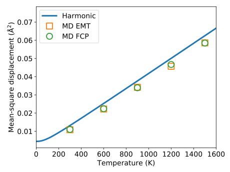

.. _tutorial_molecular_dynamics_simulations:
.. highlight:: python
.. index::
   single: Molecular dynamics simulations

Molecular dynamics simulations
==============================

The objective of this tutorial section is to demonstrate the usage of an FCP
object in a molecular dynamics (MD) simulation. Such simulations can provide
very rich information pertaining to the system including but not limited to
free energies, the lattice thermal conductivity, or phonon lifetimes, fully
accounting for anharmonic effects in the classical limit.

The integration of the equations of motion will be carried out using
functionality provided by `ASE <https://wiki.fysik.dtu.dk/ase/>`_ while
:program:`hiPhive` is used to provide an interaction model in the form of an
ASE calculator object.

Preparations
------------

First a number of parameters are set that define

* the size of the simulation cell (``cell_size``),
* the number of MD steps (``number_of_MD_steps``),
* the time step in fs (``time_step``),
* the temperatures at which MD simulations will be carried out (``temperatures``),
* the frequency at which configurations will be written to disk (``dump_interval``), and
* the names of the output files (``log_file`` and ``traj_file``)

.. literalinclude:: ../../../examples/tutorial/5_run_fourth_order_MD.py
   :end-before: # set up supercell

Next we prepare a supercell.

.. literalinclude:: ../../../examples/tutorial/5_run_fourth_order_MD.py
   :start-after: # set up supercell
   :end-before: # get force constant calculator

Then we initialize an ASE calculator object using the FCP prepared
:ref:`previously <tutorial_construct_fcp>`. To this end, we construct the
force constant matrices for the supercell to be used in the MD simulations
using the :func:`ForceConstantPotential.get_force_constants
<hiphive.ForceConstantPotential.get_force_constants>` function, which are
subsequently used to initialize an ASE calculator via the
:class:`ForceConstantCalculator <hiphive.calculators.ForceConstantCalculator>`
class.

.. literalinclude:: ../../../examples/tutorial/5_run_fourth_order_MD.py
   :start-after: # get force constant calculator
   :end-before: # run molecular dynamics simulations

MD simulations
--------------

We are ready to carry out MD simulations using the functionality provided by
`ASE <https://wiki.fysik.dtu.dk/ase/>`_. The :class:`ForceConstantCalculator
<hiphive.calculators.ForceConstantCalculator>` is attached to the supercell
structure, an integrator that samples Langevin dynamics is initialized, and the
output is prepared. Finally, the atomic velocities are initialized and the MD
simulation is run

.. literalinclude:: ../../../examples/tutorial/5_run_fourth_order_MD.py
   :start-after: # run molecular dynamics simulations
   :end-before: # compute mean-square displacement from MD trajectories

Once the MD simulations have concluded the mean-square displacements (MSDs) are
computed.

.. literalinclude:: ../../../examples/tutorial/5_run_fourth_order_MD.py
   :start-after: # compute mean-square displacement from MD trajectories

These values can now be compared with the :ref:`results obtained in the
harmonic approximation <tutorial_harmonic_msds>`::

  Molecular dynamics simulations based on FCP
  -------------------------------------------
  T =  600    msd = 0.02146 A**2
  T = 1200    msd = 0.04700 A**2

  Harmonic approximation based on FCP
  -------------------------------------------
  T =  600 K  MSD = 0.02550 A**2
  T = 1200 K  MSD = 0.05049 A**2

This comparison indicates that the harmonic approximation
systematically overestimates the MSDs. It must be noted though that
the MSD analysis from phonopy includes quantum-mechanical effects,
most notably zero-point motion, whereas the MD simulation is purely
classical. More importantly with respect to the verification of the
force constant model, a comprehensive study with tighter convergence
parameters demonstrates that the fourth-order model constructed here
closely reproduces the results from MD simulations that employ the
original (EMT) potential directly, as shown in the figure below.

  Mean-square displacement of FCC Ni as a function of temperature as
  :ref:`obtained within the harmonic approximation
  <tutorial_harmonic_msds>` as well as from molecular dynamics (MD)
  simulations based on the original potential (EMT) and a fourth-order
  Hamiltonian constructed from :ref:`MC rattled configurations
  <tutorial_prepare_reference_data>`.

Source code
-----------

.. container:: toggle

    .. container:: header

       The complete source code is available in
       ``examples/tutorial/5_run_fourth_order_MD.py``

    .. literalinclude:: ../../../examples/tutorial/5_run_fourth_order_MD.py
