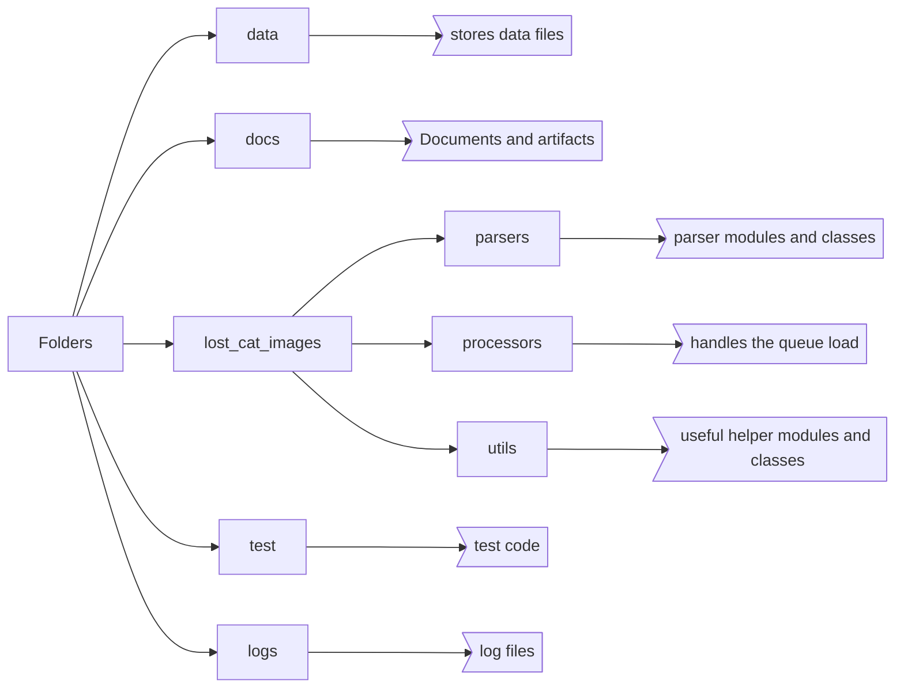

# lost cat image library

used to collect the image processing libraries together



## build

`build.bat` will build the library and will push to the PyPi Test and Main Repos, comment out the relevant lines, the PyPi upload expects the `.pypirc` file to be located in the `%users folder%\%username%` folder.

```Batchfile
:: upload the package to pypi
:: https://packaging.python.org/en/latest/tutorials/packaging-projects/
python -m pip install --upgrade build
python -m build

:: test the package
::python -m twine upload --repository testpypi dist/*
::python -m pip install --index-url https://test.pypi.org/simple/ --no-deps lost_cat_medical

:: upload to pypi
python -m twine upload --repository pypi dist/*
python -m pip install --upgrade lost_cat_images
```

## running tests

`python -m unittest discover test`

The results are output to the screen, and a log file is created for each unittest, `\logs`
The source data for the test are in the `\data` folder

## running the utility to process files

`python lost_cat_images\examples\run_v2.py`
This will use the lci_config.json file.
`--config <path to config file>` will allow the user to specify a different file to use for configuration.

### example config files

```json
{
            "paths":{
                "sources":[
                    {
                        "root": ".",
                        "folders": ["data"]
                    }
                ],
                "destination": {
                    "root": ".",
                    "folders": ["data", "twseu"]
                },
                "excel": {
                    "root": ".",
                    "folders": ["data", "twseu"],
                    "name": "yourFileName",
                    "ext": ".xlsx"
                },
                "ignore": [],
                "flags": {
                    "subs": false
                },
                "rules": [
                    {
                        "root": ".",
                        "folders": ["config"],
                        "name": "imgrules",
                        "ext": ".json"
                    }
                ]
            },
            "exports": {
                "data": [
                    "tx.raw",
                    "tx.texts",
                    "rr.detail",
                    "rr.ellipses"
                ],
                "images": [
                    "tx.markup",
                ]
            },
            "process":[
                "segmentation",
                "text",
                "grayscale",
                "threshold",
                "contours",
                "ellipses",
                "boxes",
                "grids",
                "rules"
            ],
            "caches":[
                "tx.texts"
            ],
            "segemtation":{
                "ranges": [
                    {"min":{"h": 20, "s": 0, "v": 200}, "max":{"h": 80, "s": 100, "v": 255}}
                ]
            },
            "denoise": {
                "mode": "bilateral",
                "diameter": 9,
                "sigmacolor": 75,
                "sigmaspace": 75
            },
            "grayscale": {
                "sourcetype": "BGR"
            },
            "contours": {
                "mode": 3,
                "method": 3
            },
            "ellipse": {
                "text_box_scale_ratio":1.1,
                "edge_detection_threshold":{
                    "threshold1":50,
                    "threshold2":150
                },
                "contours":{
                    "mode": 0,
                    "method": 2
                    },
                "filters":{
                    "min_contour_length":10,
                    "min_inertia_ratio":0.5,
                    "min_area": 3000,
                    "min_adjacent_distance":13
                }
            },
            "boxes": {
                "engine": "contour",
                "threshold": 0.4,
                "minsize": 25
            },
            "template": {},
            "text": {
                "engines": "azure"
            },
            "grids": {
                "minpath": 4,
                "band": 25
            },
            "count": -1
        }
```

### Config File Sections

- paths
  - sources - the source path for the scanner
    - root - should be a full path from a drive e.g., `"C:/"`
  - destination - where to save the intermediate objects and files
  - excel - path for the aoutput excel files
  - rules - path to the rules file
  - ignore: a list fo filenames to ignore
  - flags
    - subs: True | False sets whether to explore the sub directories or stay at the top level.
- exports
  - images: a list of images to export to a file
  - data: a list of data object to export
- processes: a list of processes to apply to the files, the order will be followed
- caches:  a list of objects to use as a cache to save calls
- count: a flag (-1: all files, n: stop after n files)
- `<config name>`: section for the configuration parameters to be passed to the processes

### available processes

- text
- segmentation
- denoise
- grayscale
- threshold
- ellipses
- boxes
- grids
- rules
